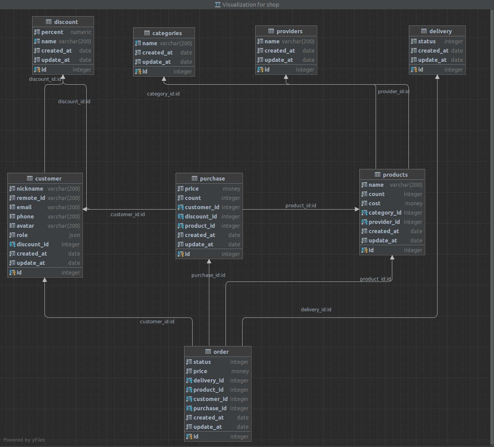

# 4. Урок 4 DDL: создание, изменение и удаление объектов в PostgresSQL
- Задание: Используя операторы DDL создайте на примере схемы интернет-магазина:

## Schema


## [Role](../Deployment/DataBaseInit/Postgres/create_role.sql)
```sql
create user "shop_root" with password 'root';
GRANT ALL PRIVILEGES ON DATABASE "shop" to shop_root;
```

## [DataBase](../Deployment/DataBaseInit/Postgres/create_database.sql)
```sql
create DATABASE shop;
```

## [Create schema](../Deployment/DataBaseInit/Postgres/create_schema.sql)
```sql
CREATE SCHEMA category;
CREATE SCHEMA delivery;
CREATE SCHEMA discount;
CREATE SCHEMA "order";
CREATE SCHEMA product;
CREATE SCHEMA provider;
CREATE SCHEMA purchase ;
CREATE SCHEMA "user";
```

## [Create tables](../Deployment/DataBaseInit/Postgres/create_tables.sql)
```sql
CREATE TABLE category.categories
(
    "id"       int          NOT NULL,
    name       varchar(200) NOT NULL,
    created_at date         NOT NULL,
    update_at  date         NOT NULL,
    CONSTRAINT PK_1 PRIMARY KEY ("id"),
    CONSTRAINT U_1 UNIQUE (name)
);

CREATE TABLE delivery.delivery
(
    "id"       int  NOT NULL,
    status     int  NOT NULL,
    created_at date NOT NULL,
    update_at  date NOT NULL,
    CONSTRAINT PK_1 PRIMARY KEY ("id")
);

CREATE TABLE discount.discount
(
    "id"       int          NOT NULL,
    "percent"  decimal      NOT NULL,
    name       varchar(200) NOT NULL,
    created_at date         NOT NULL,
    update_at  date         NOT NULL,
    CONSTRAINT PK_1 PRIMARY KEY ("id"),
    CONSTRAINT U_1 UNIQUE (name)
);

CREATE TABLE provider.providers
(
    "id"       int          NOT NULL,
    name       varchar(200) NOT NULL,
    created_at date         NOT NULL,
    update_at  date         NOT NULL,
    CONSTRAINT PK_1 PRIMARY KEY ("id")
);

CREATE TABLE "user".customer
(
    "id"        int          NOT NULL,
    nickname    varchar(200) NOT NULL,
    remote_id   varchar(200) NOT NULL,
    email       varchar(200) NULL,
    phone       varchar(200) NULL,
    avatar      varchar(200) NULL,
    role        json         NOT NULL,
    discount_id int NULL,
    created_at  date         NOT NULL,
    update_at   date         NOT NULL,
    CONSTRAINT PK_1 PRIMARY KEY ("id"),
    CONSTRAINT FK_1 FOREIGN KEY (discount_id) REFERENCES discount.discount ("id")
);

CREATE INDEX FK_1 ON "user".customer
    (
     discount_id
        );

CREATE TABLE product.products
(
    "id"        int          NOT NULL,
    name        varchar(200) NOT NULL,
    "count"     int          NOT NULL,
    cost        money        NOT NULL,
    category_id int          NOT NULL,
    provider_id int          NOT NULL,
    created_at  date         NOT NULL,
    update_at   date         NOT NULL,
    CONSTRAINT PK_1 PRIMARY KEY ("id"),
    CONSTRAINT FK_4 FOREIGN KEY (category_id) REFERENCES category.categories ("id"),
    CONSTRAINT FK_5 FOREIGN KEY (provider_id) REFERENCES provider.providers ("id")
);

CREATE INDEX FK_1 ON product.products
    (
     category_id
        );

CREATE INDEX FK_2 ON product.products
    (
     provider_id
        );


CREATE TABLE purchase.purchase
(
    "id"        int   NOT NULL,
    price       money NOT NULL,
    "count"     int   NOT NULL,
    customer_id int   NOT NULL,
    discount_id int NULL,
    product_id  int   NOT NULL,
    created_at  date  NOT NULL,
    update_at   date  NOT NULL,
    CONSTRAINT PK_1 PRIMARY KEY ("id"),
    CONSTRAINT FK_2 FOREIGN KEY (customer_id) REFERENCES "user".customer ("id"),
    CONSTRAINT FK_3 FOREIGN KEY (discount_id) REFERENCES discount.discount ("id"),
    CONSTRAINT FK_6 FOREIGN KEY (product_id) REFERENCES product.products ("id")
);

CREATE INDEX FK_1 ON purchase.purchase
    (
     customer_id
        );

CREATE INDEX FK_2 ON purchase.purchase
    (
     discount_id
        );

CREATE INDEX FK_3 ON purchase.purchase
    (
     product_id
        );


CREATE TABLE "order"."order"
(
    "id"        int   NOT NULL,
    status      int   NOT NULL,
    price       money NOT NULL,
    delivery_id int   NOT NULL,
    product_id  int   NOT NULL,
    customer_id int   NOT NULL,
    purchase_id int NULL,
    created_at  date  NOT NULL,
    update_at   date  NOT NULL,
    CONSTRAINT PK_1 PRIMARY KEY ("id"),
    CONSTRAINT FK_7 FOREIGN KEY (delivery_id) REFERENCES delivery.delivery ("id"),
    CONSTRAINT FK_8 FOREIGN KEY (product_id) REFERENCES product.products ("id"),
    CONSTRAINT FK_9 FOREIGN KEY (customer_id) REFERENCES "user".customer ("id"),
    CONSTRAINT FK_10 FOREIGN KEY (purchase_id) REFERENCES purchase.purchase ("id")
);

CREATE INDEX FK_1 ON "order"."order"
    (
     delivery_id
        );

CREATE INDEX FK_2 ON "order"."order"
    (
     product_id
        );

CREATE INDEX FK_3 ON "order"."order"
    (
     customer_id
        );

CREATE INDEX FK_4 ON "order"."order"
    (
     purchase_id
        );
```

