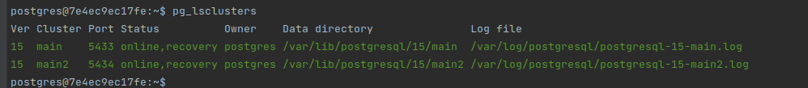

# 8. Репликация

## Физическая репликация:
### Задание
- Настроить физическую репликации между двумя кластерами базы данных
- Репликация должна работать использую "слот репликации"
- Реплика должна отставать от мастера на 5 минут

### docker
```docker
  postgresql_01:
    image: postgres
    container_name: postgresql_01
    restart: always
    volumes:
      - ./Deployment/data/postgresql_01:/var/lib/postgresql/data
    environment:
      POSTGRES_PASSWORD: root
```
### Команды
```
    - docker exec -it postgresql_01 bash
    - su - postgres
    - psql -U postgres -p 5432
    - create database otus;
    
    ```sql
        create table student as
        select
        generate_series(10,20) as id,
        md5(random()::text)::char(10) as fio;
    ```
    
    - select * from student;
    - pg_createcluster 15 main
    - pg_createcluster 15 main2
    - pg_lsclusters
    - rm -rf /var/lib/postgresql/14/main
    - rm -rf /var/lib/postgresql/14/main2
    - pg_basebackup -U postgres  -p 5432 -R -D /var/lib/postgresql/14/main
    - pg_basebackup -U postgres  -p 5432 -R -D /var/lib/postgresql/14/main2
    - pg_ctlcluster 15 main start	
    - pg_ctlcluster 15 main2 start	
```
### Фото


## Логическая репликация:
### Задание
- Создать на первом кластере базу данных, таблицу и наполнить ее данными (на ваше усмотрение)
- На нем же создать публикацию этой таблицы
- На новом кластере подписаться на эту публикацию
- Убедиться что она среплицировалась. Добавить записи в эту таблицу на основном сервере и убедиться, что они видны на логической реплике

```docker
  postgresql_01:
    image: postgres
    container_name: postgresql_01
    restart: always
    volumes:
      - ./Deployment/data/postgresql_01:/var/lib/postgresql/data
    environment:
      POSTGRES_PASSWORD: root
```
### Команды
```
    - docker exec -it postgresql_01 bash
    - su - postgres
    - psql -U postgres -p 5432
    - create database otus;
    
    ```sql
        create table student as
        select
        generate_series(10,20) as id,
        md5(random()::text)::char(10) as fio;
    ```
    
    - select * from student;
    - CREATE PUBLICATION test_pub FOR TABLE student;
    - pg_createcluster 15 main
    - pg_lsclusters
    - pg_ctlcluster 15 main start	
    - psql -U postgres -p 5433
    - CREATE SUBSCRIPTION otus_sub 
        CONNECTION 'host=localhost port=5432 user=postgres password=123pas dbname=otus' 
        PUBLICATION test_pub WITH (copy_data = true);
    - psql -U postgres -p 5432
    - INSERT INTO student VALUES (21, 'testset');
```